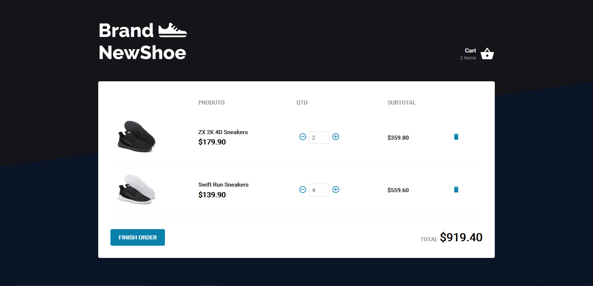

<h1 align="center">
  BrandNewShoe
</h1>
<h1 align="center">
    
    
</h1>

<br>

## 🧪 Technologies

This project was made using the followings Technologies:
- [React](https://reactjs.org)
- [TypeScript](https://www.typescriptlang.org/)
- [Styled Components](https://styled-components.com/)
- [JSON server](https://github.com/typicode/json-server)


## 🪐 Running
Para iniciá-lo, siga os passos abaixo:
```bash
# Install all dependencies
$ yarn

# Starting JSON API
$ yarn server

# Starting App
$ yarn start
```
App will be available on port: http://localhost:3000.


## 💻 Project

BrandNewShoe is a pretty sneaker e-commerce; and a great project to you improve your React skills.


---

Made with 🧡 by Gabriel Fernandes 👋 [Join our community!](https://ahub.tech/discord)